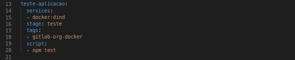
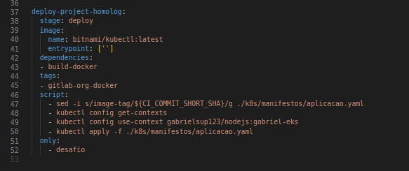

# EXPLICAÇÃO PIPELINE

1. No stage de teste será executado os scripts de testes desenvolvidos. É importante pois a depender dos testes pode validar erros simples ou mais complexos da aplicação. Caso quebre nessa etapa e como é feito em todas as branchs evita de mergear código falho para as outras branchs.

2. A etapa 2 é o stage de build, onde é gerado o artefato, que é a imagem docker e enviado a mesma para o regsitry.

3. Stage de deploy, nela é realizado o comando sed para a alteração da versão da imagem no deployment, a conexão com o kubernetes e o deploy da aplicação no kubernetes.

# Diagrama Kubernetetes na AWS 

Nesse diagrama foi pensado em uma arquitetura simples, para atender a necessidade informada. Além dos componentes da infraestrutura também é instalado o Ingress Controller Nginx para realizar o redirecionamento dos acessos para os ingress e serviços das aplicações.

## Componentes da infraestrutura para o cluster eks

- VPC: 10.0.0.16
- SUBNETS PRIVADAS: 2
- SUBNETS PUBLICAS: 2
- INTERNET GATEWAY: 1
- NAT GATEWAY: 1
- TABELA DE ROTA PRIVADA: 1
- TABELA DE ROTA PUBLICA: 1

## Componentes da infraestrutura para o banco RDS

- VPC: 172.16.0.0/16
- SUBNETS PRIVADAS: 2
- SUBNETS PUBLICAS: 1
- INTERNET GATEWAY: 1
- TABELA DE ROTA PRIVADA: 1
- TABELA DE ROTA PUBLICA: 1

A ideia de criar vpcs distintas para o banco e para o kubernetes, é que o kuberntes tende a ser mais instável, podendo ser que esse recurso seja eliminado, ou substituido por outro, para evitar futuros problemas achei melhor segrega-las, assim os serviços poderão trabalhar independentemente. 

O RDS foi criado em um grupo de subredes privadas em azs diferentes. A escolha de subredes privadas é para evitar ataques vindo da internet. Para que um desenvolvedor possa acessar a aplicação foi criado uma ec2 na subnet publica para funcionar como um bastion host. Para que os nodes do eks possam se comunicar com o banco foi criado um vpc-peering para conectar as vpcs e adicionado a rota na tabela de rotas.

# Dashboard Observabilidade.

Criado um dashboard para monitoramento do uso de cpus pelos pods, pode ser aplicado os filtros de namespace para facilitar o monitoramento.

